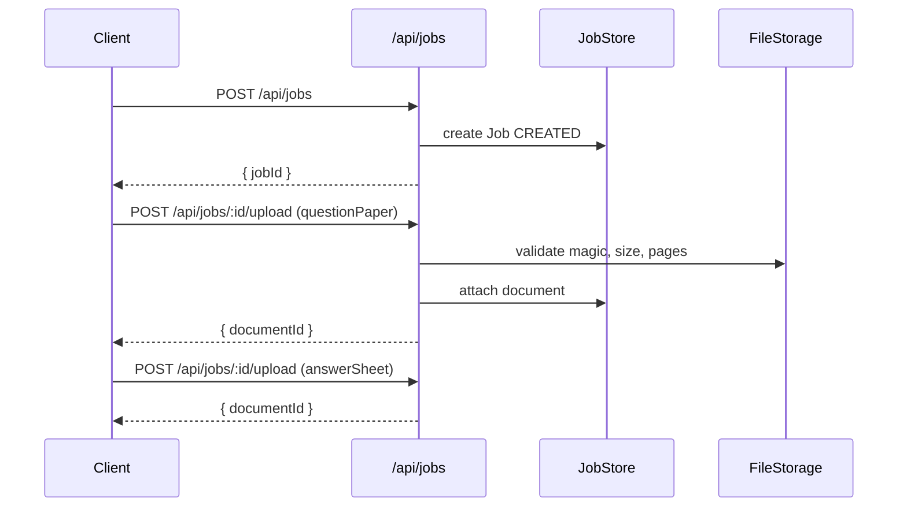
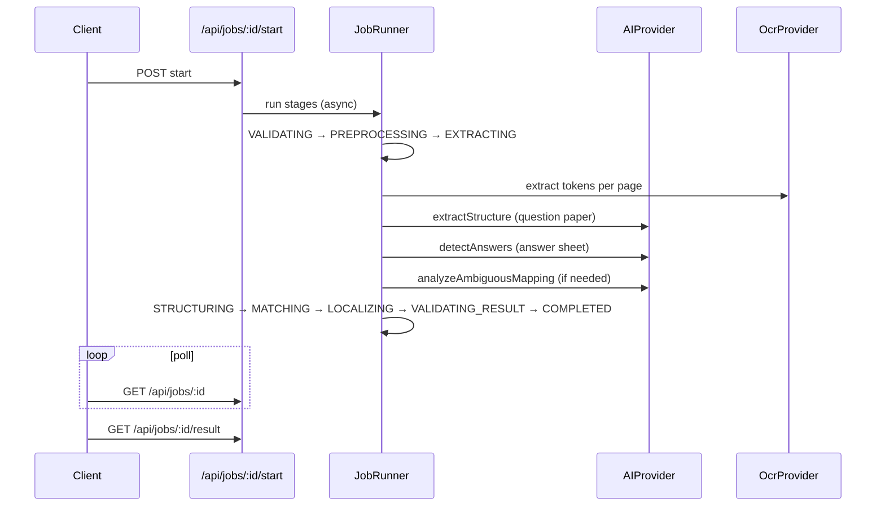
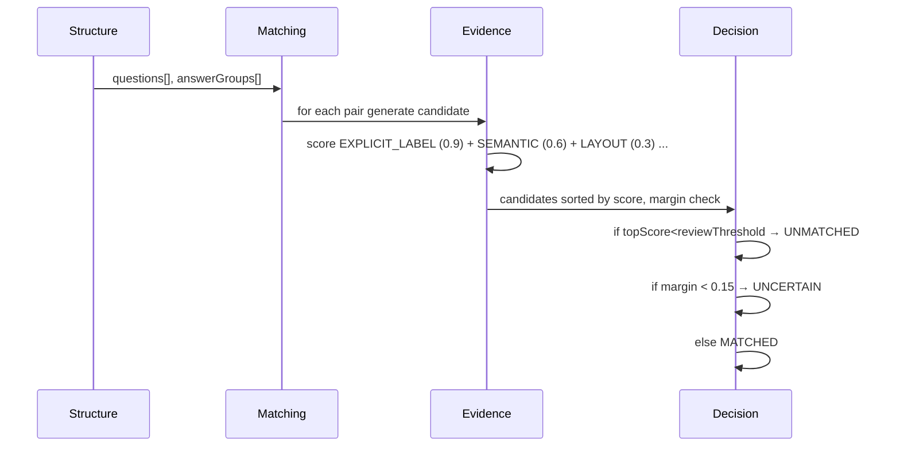
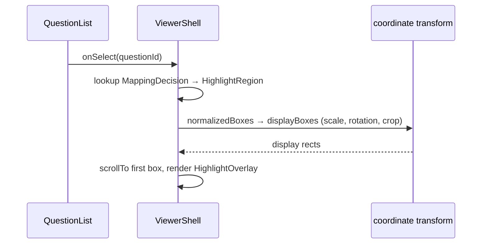
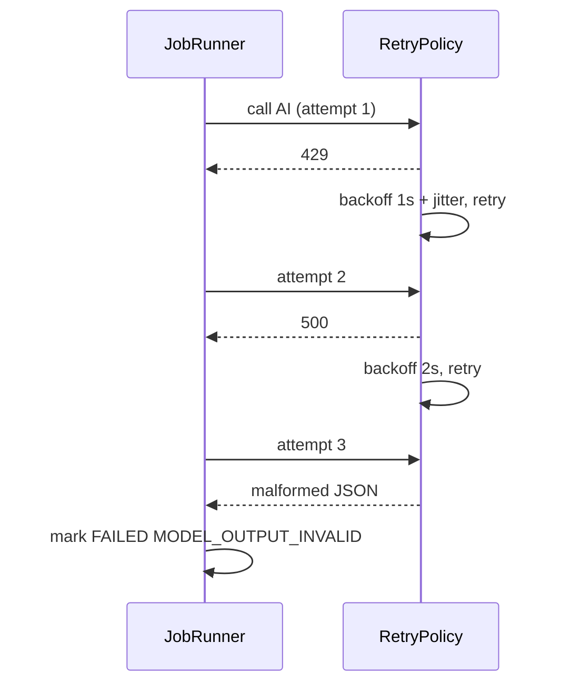

# ARCHITECTURE.md — VedaAI Deep Dive

## 1. Conceptual Pipeline
```
DOCUMENT
  → OBSERVATION (file bytes + magic validation)
  → NORMALIZED REPRESENTATION (PDF pages → images @2×, coords preserved)
  → STRUCTURE (QuestionNode hierarchy, reading order)
  → CANDIDATE GENERATION (answer regions + question candidates)
  → EVIDENCE (multi-signal)
  → DECISION (MATCHED|UNCERTAIN|UNMATCHED|UNANSWERED|PARTIAL|CONTINUATION|DUPLICATE)
  → VALIDATION (Zod schemas, domain invariants)
  → LOCALIZATION (normalized [0,1] → display)
  → UI (question list + viewer + highlights)
```

## 2. Module Map
```
src/types/index.ts ── canonical data model
src/lib/config/    ── validated env, thresholds
src/lib/errors/    ── typed codes, structured logs
src/lib/files/     ── upload validation, sanitization
src/lib/documents/ ── PDF inspection, image norm
src/lib/ocr/       ── OcrProvider interface
src/lib/structure/ ── numbering, hierarchy, reading order, continuation
src/lib/matching/  ── candidate retrieval, semantic (AI-assisted)
src/lib/evidence/  ── Evidence aggregation
src/lib/decision/  ── decision taxonomy, review thresholds
src/lib/coordinates/ ── transforms (pure, tested)
src/lib/jobs/      ── lifecycle, idempotency, retries, progress
src/lib/storage/   ── FileStorage, JobStore, ArtifactStore interfaces
src/lib/ai/        ── AIProvider + OpenAI impl + fixtures
src/lib/validation/ ── Zod schemas for external + AI outputs
src/components/    ── UI primitives + domain components
src/app/api/       ── Route Handlers (typed request/response)
```

## 3. Data Model (canonical)
```ts
Document { id, jobId, kind: 'questionPaper'|'answerSheet', originalName, mime, size, pageCount, pageIds }
DocumentPage { id, documentId, pageNumber, width, height, rotation, artifactId }
QuestionNode { id, sourceDocumentId, pageRefs, sourceRegions[], rawNumber, normalizedNumber, text, rawText, normalizedText, parentQuestionId?, partType?, orderIndex, depth, section?, marks?, confidence, evidence[] }
AnswerRegion { id, documentId, pageId, regionType, rawText, normalizedText, sourceBoxes[], normalizedBoxes[], questionLabel?, labelConfidence?, ocrConfidence?, visualConfidence?, orderIndex, continuationGroupId? }
AnswerGroup { id, regions: AnswerRegion[], primaryRegionId, continuationGroupId? }
MappingCandidate { questionId, answerGroupId, evidence[], score }
MappingDecision { questionId, answerGroupId?, status: DecisionStatus, confidence, evidence[], reason }
HighlightRegion { pageId, boxes: NormalizedBox[], confidence, source }
ProcessingJob { id, status, currentStage, createdAt, updatedAt, questionPaperFileId?, answerSheetFileId?, progress?, error?, pipelineVersion, modelVersion? }
```

## 4. Sequence Diagrams

### 4.1 Upload


### 4.2 Processing


### 4.3 Mapping


### 4.4 Highlight


### 4.5 Failure / Retry


## 5. Coordinate System
Canonical normalized `[0,1]` relative to original page dimensions (width, height). Transforms are explicit:
- `toProcessing(original, scale)`
- `toDisplay(normalized, displayDims, rotation, crop)`
All invertible; tested at scales 0.5/1/2 and rotations 0/90/180/270. No scattered math in UI; only `src/lib/coordinates/`.

## 6. Job Concurrency & Idempotency
Idempotency key: `sha256(jobId:stage:pipelineVersion:documentHash)`. Duplicate start within same key is no-op. Concurrency limit `MAX_CONCURRENT_AI=2` (semaphore in `lib/jobs/runner.ts`).

## 7. Storage
In-memory by default; interfaces allow swap. `LocalFileStorage` writes `os.tmpdir()/veda-ai/{jobId}/{docId}.pdf|.png`. Cleanup on completed/failed/cancelled + TTL sweep.

## 8. AI Boundaries
AI never handles file validation, coordinate math, persistence, retries, secrets. All responses Zod-validated.

## 9. Versioning
Each job stores `pipelineVersion` (from `package.json`), `promptVersion` (hash of prompts), `modelVersion` (`AI_MODEL`), and processing lib versions (pdfjs). Enables debugging diffs.
